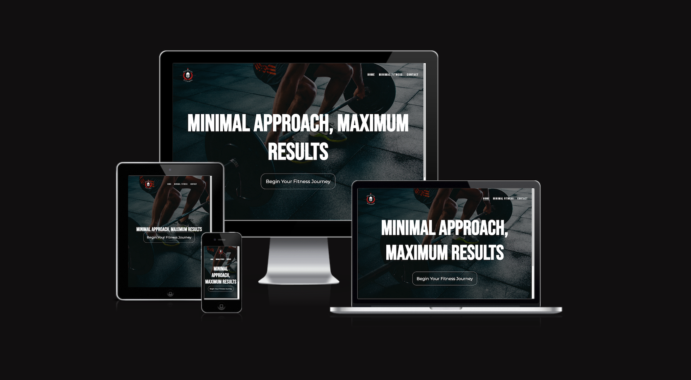

# Fitness Made Minimal
(Developer: Maksims Buraks)

[live web-page](https://maksimb96.github.io/FitnessMadeMinimal/)

## Table of contents

1. [Project Goals](#project-goals)
    * [User Goals](#user-goals)
    * [Site Owner Goals](#site-owner-goals)
2. [User Experience](#user-experience)
    * [Target Audience](#target-audience)
    * [User Requirements and Expectations](#user-requirements-and-expectations)
    * [User Stories](#user-stories)
3. [Design](#design)
    * [Design](#design-choices)
    * [Color](#colors)
    * [Fonts](#font)
    * [Structure](#structure)
    * [Wireframe](#wire-frame)
4. [Tech Used](#tech)
    * [Languages](#languages)
    * [Tools](#tools)
5. [Features](#features)
6. [Code Validation & Testing](#validation)
    * [Html](#html-val)
    * [Css](#css-val)
    * [Acessability](#ac-val)
    * [Perforamnce](#per-val)
    * [User Story Testing](#user-story-test)
7. [Bugs](#bugs)
8. [Deployment](#deploy)
9. [Credits](#credit)
10. [Acknowledgements](#Ackno)

## Project Goals

