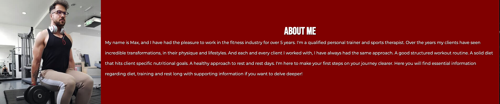
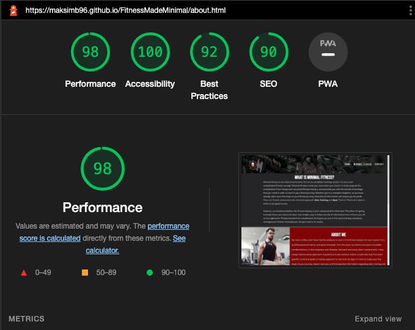

# Fitness Made Minimal
(Developer: Maksims Buraks)

[live web-page](https://maksimb96.github.io/FitnessMadeMinimal/)

## Table of contents

1. [Project Goals](#project-goals)
    * [User Goals](#user-goals)
    * [Site Owner Goals](#site-owner-goals)
2. [User Experience](#user-experience)
    * [Target Audience](#target-audience)
    * [User Requirements and Expectations](#user-requirements-and-expectations)
    * [User Stories](#user-stories)
3. [Design](#design)
    * [Design](#design-choices)
    * [Color](#colors)
    * [Fonts](#font)
    * [Structure](#structure)
    * [Wireframe](#wire-frame)
4. [Tech Used](#tech)
    * [Languages](#languages)
    * [Tools](#tools)
5. [Features](#features)
6. [Code Validation & Testing](#validation)
    * [Html](#html-val)
    * [Css](#css-val)
    * [Acessability](#ac-val)
    * [Perforamnce](#per-val)
    * [User Story Testing](#user-story-test)
7. [Bugs](#bugs)
8. [Deployment](#deploy)
9. [Credits](#credit)
10. [Acknowledgements](#Ackno)

## Project Goals

### User Goals
    -Finding a site that provides simple but effective fitness advice
    -Gain a better understanding of the fundamentals of training
    -Gain a better understanding of the fundamentals of diet
    -Gain a better understanding of the fundamentals of rest
    -Finding supporting information to gain deeper knowledge
    -Get in contact with Personal trainer for additional advice

### Site Owner Goals
    -Provide a simple, modern and un-cluttered approach to fitness
    -Provide information in relation to the fundamentals with supporting links and videos
    -Provide a means to get into contact
    -Provide a site that reflects these ideas

## User Experience

### Target Audience
    -People looking for a place to begin training
    -People looking for an un-complicated approach to training
    -People looking for an un-complicated approach to rest and diet
    -People looking for a way to contact the PT if needs be

### User Requirements and Expectations
    -A simple and natural way to navigate the website
    -Quick acessibility to relevant information
    -Appealing design that responds accordingly
    -A simple way to get in contact, and leave additional information
    -Small amounts of reading with the ability to find additional information
    -Accessibility

### User Stories

#### First-time User
1. As a first time user, I want more information regarding fitness
2. As a first time user, I want more information regarding training fundamentals
3. As a first time user, I want information presented in one location
4. As a first time user, I want to get in contact with a fitness professional in order to obtain more answers

#### Returning User
5. As a returning user I want to refresh my knowledge on fitness
6. As a returnong user I want to get back on track with my calorie intake
7. As a returning user I want to get back on track with my training 
8. As a returning user I want to have a clear pathway to getting into contact with a fitness professional
9. As a returning user I want to be able to locate relevant social links

#### Site Owner
10. As a site owner I want people to locate relevant information to fitness
11. As a site owner I want people to get to know the PT
12. As a site owner I want individuals to get in contact

## Design

### Design Choices
The Website was designed with the main company colours and design in mind. Bold strong colours, but with minimal and clean design.
Clean font choices, colour choices and background images, support fitness and are relevant to the topics.

### Colour
Colour choices are based on the main company colours, red, white, black and notes of matte black an grays, alongside lighter reds for better contrast I tested colours on wave in order to make sure that
a clear contrast between elements was met.
 

### Fonts
Bebas Neue with a cursive fall-back was used as the main heading and nav text due to it's modern and crisp design.
 
Montserrat with sans-serif fall back was used as it compliments Bebas and provides an over-all better reading experience.

### Structure
The website is designed in such a way that goes with the main moto. Minimal approach, Maximum results. Therefore the layout required to be clean, consice and straight to the point
The nav bar contains all relevant points of interest with the main logo to the left and nav bar links to the right.
 

The website is made up of 3 pages:

    -The home page that draws a user and links directly to other points of interest along with the main body of the website the 'minimal fitness'.
    -The minimal fitness page that contains all relevant info along with supporting video aids and websites.
    -A contact page that allows easy contact along with additional queries.

### Wireframes

Home

Minimal-Fintess

Contact

## Technologies Used

### Languages
    -HTML
    -CSS

### Tools
    -Git
    -Git Hub
    -Git Pod
    -Balsamiq
    -Google Fonts
    -bl.ocks.org
    -Font Awesome
    -Favicon.io

## Features
The Website consists of 3 pages with 11 features

### Logo and Nav-Bar
    -featured on all three pages
    -Nav bar is fully responsive and changes to a condensed veiw on mobile devices. Nav bar links to all relevant pages allowing for quick access.
    -Nav bar has selected item in order to give clear feedback to location.
    -Pages 2/3 have a slight difference in appearance but over all same design in order to not disrupt immersion.
    -Nav bar hover turns text red in order to give clear feedback to where you are about to go.
    

### Footer
    -footer conistent on all pages with hover effect in order to provide clear feedback on selection
    -User stories adressed: 9, 12.

### Home page Slogan animation, button hover and footer hover
    -main slogan zooms in on landing page to draw in visitors
    -Button has hover effect to provide selection feedback
    -footer icons have hover effect to provide clear feedback
    -User stories adressed: 9.

### What is Minimal Fitness segemt
    -Provides information regarding what this website aims to achieve
    -User stories adressed: 3.

### About Me segment
    -Provides information regarding the personal trainer
    -User stories adressed: 11
   

### Images of the fitness elements
    -Provides visual representation regarding the 3 elements of fitness

### Iframe in Accordion
    -Provides supporting material with full user control
     -User stories adressed: 3.

### Accordion with hover selector
    -Provides condensed info that expands on button press
    -User stories adressed: 1, 2,  5, 6, 7, 10.

### Contact Form
    -Provides a medium for contact and user interaction
    -User stories adressed: 12,8.

## Validation

### HTML Validation
W3C mark-up was utilised in order to validate html of the website. All Pages pass with no errors.

Home

Minimal Fitness

Contact

 

### CSS Validation
W3C CSS validator was utilised in order to make sure the css code passes standards with no errors.

Full Document

 

### Accessability
Wave WebAIM was utilized in order to make sure the website met high accessability standards. All pages pass with no errors or contrast errors.

Home

Minimal Fitness

Contact

 

### Performance
Google light house was used in order to confirm good standards of performace

Home

Minimal Fitness

Contact

